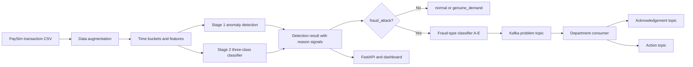

# AI Fraud Spike Detector

> For complete implementation, environment, dependency, and execution instructions, see the separate [RunBook.md](RunBook.md).

## Project Overview

The AI Fraud Spike Detector is an end-to-end fraud analytics and event-routing system built on PaySim transaction data. It answers a practical operational question:

> Is a sudden increase in transaction activity a genuine business demand spike, or is it an attack hidden inside normal traffic?

The project combines statistical anomaly detection, machine-learning classification, fraud-type prediction, explainable signals, and Kafka-based department routing. It does not treat every busy period as fraud. Instead, it separates normal activity, legitimate demand, and suspicious attack behavior before sending actionable events to the appropriate investigation team.

## Problem Statement

Financial systems receive large volumes of transactions continuously. A sudden increase in traffic can have very different causes:

- A legitimate sale, campaign, salary day, or seasonal event.
- A normal fluctuation in customer behavior.
- A coordinated attack such as card testing, account takeover, mule activity, or account draining.

Detecting only high transaction volume creates too many false positives because genuine demand can look anomalous. Detecting only individual fraudulent transactions can miss coordinated activity spread across many accounts or payment instruments.

This project addresses the problem at the time-bucket level. It aggregates transactions into short activity windows, studies the shape of each window, classifies its business meaning, identifies the likely fraud pattern, and routes the result to a department for action.

## What Makes the Project Unique

1. **It distinguishes demand from fraud.** A high-volume period is not automatically labeled as an attack. `genuine_demand` is a first-class class beside `normal` and `fraud_attack`.
2. **It uses a two-stage detection design.** Statistical monitoring identifies unusual behavior, while supervised classification studies the broader transaction shape.
3. **It predicts the type of fraud after detecting an attack.** The system goes beyond a binary fraud flag and predicts patterns A-E for investigation and routing.
4. **It uses synthetic but structured attack patterns.** PaySim is augmented with labeled patterns so the system can be evaluated on scenarios that public transaction datasets usually do not provide.
5. **It routes events operationally with Kafka.** A fraud event is published to a type-specific topic, acknowledged by a department consumer, and followed by an action event.
6. **It keeps investigation signals separate from the main detector.** IP and BIN concentration are retained for cluster investigation and fraud-type prediction without allowing them to dominate the main three-class classifier.
7. **It evaluates chronologically.** The holdout set is based on later time steps, which better reflects future use and reduces time leakage.

## End-to-End Architecture



### Main execution flow

1. PaySim transaction rows are loaded from the raw data source.
2. Synthetic fraud and genuine-demand activity is injected into selected time steps.
3. Transactions are aggregated into labeled time buckets.
4. Stage 1 calculates statistical anomaly signals from transaction volume.
5. Stage 2 classifies every bucket as `normal`, `genuine_demand`, or `fraud_attack`.
6. Fraud buckets are passed to the fraud-type classifier.
7. Fraud events are published to Kafka topics based on their predicted type.
8. Department consumers acknowledge the events and publish a placeholder action.
9. The API and dashboard expose health, model, evaluation, pipeline, and live event results.

## Data and Time Buckets

### Source data

The project starts with the PaySim synthetic mobile-money transaction dataset. The source contains transaction-level fields such as transaction type, amount, originating and destination accounts, time step, and a native fraud indicator.

PaySim is useful for experimentation, but it is not production banking data. The project adds controlled synthetic examples because the original dataset does not contain enough labeled examples for the five attack patterns and genuine-demand scenarios required here.

### Synthetic activity injection

The simulation layer adds two kinds of labeled events:

| Label | Meaning |
| --- | --- |
| `normal` | Ordinary activity not selected for injection. |
| `genuine_demand` | A legitimate high-activity period with many customers and realistic shared infrastructure. |
| `fraud_attack` | A coordinated synthetic attack using one of fraud types A-E. |

The injected fraud patterns are:

| Type | Pattern | Investigation interpretation |
| --- | --- | --- |
| A | Many senders to one destination | Card-testing bot farm or concentrated target activity. |
| B | Few senders to many destinations | Mule or account-takeover network. |
| C | Many small transactions | Card-testing probes. |
| D | Sudden high-value transfers | Account drain or high-value compromise. |
| E | Rapid repeated transactions | Compromised session or automated repeat activity. |

The injection process adds IP addresses and card BIN values to support concentration analysis. Fraud activity usually reuses a smaller core pool of IPs and BINs, while genuine demand uses broader but still realistic shared infrastructure. Noise is deliberately included so that the classifier is not given a perfectly clean shortcut.

### Bucket construction

Transactions are grouped by the PaySim `step` field. Each bucket represents activity during one time step and contains aggregate behavioral features:

| Feature | Meaning |
| --- | --- |
| `txn_count` | Number of transactions in the bucket. |
| `unique_senders` | Number of distinct originating accounts. |
| `avg_amount` | Average transaction amount. |
| `total_amount` | Total value transferred. |
| `payment_count` | Number of payment transactions. |
| `transfer_count` | Number of transfer transactions. |
| `unique_ratio` | Sender diversity relative to transaction count. |
| `amount_ratio` | Average-value representation derived from total activity. |
| `fraud_rate` | Native PaySim fraud count relative to bucket size. |
| `top_ip_share` | Share of activity from the most common IP. |
| `top_bin_share` | Share of activity using the most common BIN. |
| `label` | Synthetic target: normal, genuine demand, or fraud attack. |

The main generated artifacts are `data/processed/buckets_labeled.csv` and `data/processed/raw_augmented.csv`. The bucket table is used for modeling; the augmented row-level table supports IP/BIN investigation and cluster reports.

## Stage 1: Statistical Anomaly Detection

Stage 1 is a volume-monitoring layer. It asks:

> Is this bucket unusually different from the overall activity pattern?

It monitors `txn_count` using three complementary signals:

### Global z-score

The bucket count is compared with the global mean and standard deviation. This detects buckets far above or below the overall baseline.

### EWMA z-score

An exponentially weighted moving average gives more importance to recent activity. This helps identify local changes that may not look extreme against the full dataset baseline.

### CUSUM signal

CUSUM tracks sustained directional changes in the standardized series. It is useful when activity changes gradually or remains shifted across consecutive buckets.

Stage 1 sets `anomaly_flag = 1` when any condition is met:

- Absolute global z-score is greater than `2.5`.
- Absolute EWMA z-score is greater than `2.5`.
- CUSUM signal is greater than `3.0`.

Stage 1 is intentionally a context signal rather than the final fraud decision. A genuine campaign can trigger an anomaly, and a carefully distributed attack may not create an extreme volume spike.

## Stage 2: Three-Class Classifiers

Stage 2 studies the transaction shape of every bucket. It predicts `normal`, `genuine_demand`, or `fraud_attack`.

The main classifier uses these six features:

```text
txn_count
unique_senders
avg_amount
total_amount
unique_ratio
amount_ratio
```

The main classifier intentionally does not use `top_ip_share` or `top_bin_share`. Those features are powerful investigation signals, but using them as primary classification features can make the synthetic dataset unrealistically easy to separate and can cause the model to rely too heavily on infrastructure artifacts.

### Models evaluated

The project compares Random Forest, Gradient Boosting, and XGBoost. The all-model workflow evaluates the candidates on the same chronological holdout and writes the comparison to `models/model_metrics.json`. The default selected model is XGBoost in the model-comparison workflow. In the current evaluation, the Stage 2 XGBoost classifier achieved **93% accuracy** across `normal`, `genuine_demand`, and `fraud_attack`.

The resulting Stage 2 model predicts the class for every bucket, regardless of whether Stage 1 flagged it.

### Final fraud decision

The final fraud flag is based on the Stage 2 prediction:

```text
final_flag = 1 when stage2_pred == "fraud_attack"
```

It is not gated by Stage 1. This matters because an attack can have ordinary total volume while still showing suspicious transaction structure. Stage 1 remains attached to the result as supporting evidence and a reason signal.

## Fraud-Type Classifier

After Stage 2 identifies a bucket as `fraud_attack`, the second classifier predicts the more specific fraud type: A, B, C, D, or E.

The fraud-type model uses the general bucket features plus infrastructure concentration features:

```text
txn_count
unique_senders
avg_amount
total_amount
unique_ratio
amount_ratio
top_ip_share
top_bin_share
```

It is trained as a fraud-only classification problem. The training workflow temporarily creates a larger fraud-only sample so each type has more examples. The model is an XGBoost classifier and is saved as `models/fraud_type_model.pkl`.

### Fraud-Type Classifier Accuracy?

The current fraud-type evaluation is approximately **80% accuracy on 40 held-out fraud buckets**, meaning 32 predictions were correct and 8 were incorrect in that evaluation run.

This is harder than the main detector. The main detector only distinguishes fraud from normal traffic and genuine demand. The fraud-type model must infer the exact attack story from aggregate features, and several patterns can produce similar summaries.

- Types D and E are easier to separate in the current experiment because high-value transfers and rapid repeated activity create distinctive signals.
- Types A, B, and C overlap more because sender concentration, destination behavior, and small transaction patterns can look similar after aggregation.
- The evaluation set is small, so a different random selection of injected steps can change the percentage.
- The patterns are simulated and intentionally noisy, which makes the benchmark more realistic but also limits perfect classification.

This fraud-type score does **not** represent the effectiveness of the complete fraud detector. Fraud-type prediction is a downstream explanation and routing task after the primary three-class decision. Improving it would require more varied labeled events, sequence-level features, row-level behavioral features, and validation against real production fraud data.

## Kafka Event Architecture

Kafka provides the event-driven part of the system. It decouples detection from department workflows so the detector can publish an event without directly implementing every downstream investigation process.

### Producer

The Kafka producer receives a fraud bucket and creates an event containing:

- A unique `event_id`.
- The PaySim `step`.
- The predicted fraud type.
- UTC detection time.
- Selected bucket features such as transaction count, unique ratio, and average amount.

The event is published to the problem topic for the predicted fraud type.

### Topic naming

Topics use this convention:

```text
fraud.type<LETTER>.<STAGE>
```

Fraud letters are `A`, `B`, `C`, `D`, and `E`. Lifecycle stages are `problem`, `acknowledgement`, and `action`.

### Problem topics

The detector publishes new cases to:

```text
fraud.typeA.problem
fraud.typeB.problem
fraud.typeC.problem
fraud.typeD.problem
fraud.typeE.problem
```

These topics are consumed by the department responsible for that pattern:

| Fraud type | Department |
| --- | --- |
| A | Cyber-Crime Unit |
| B | AML / Mule Network Team |
| C | Card Issuer Relations |
| D | Senior Fraud Ops (Escalation) |
| E | Account Security Team |

### Acknowledgement topics

When a department consumer receives a problem event, it publishes an acknowledgement such as:

```text
fraud.typeA.acknowledgement
```

The acknowledgement includes the event ID, status `under_review`, and the department handling the case. The same pattern applies to types B through E.

### Action topics

After acknowledgement, the consumer publishes an action event such as:

```text
fraud.typeA.action
```

The current consumer uses a placeholder decision of `flagged`. In production, this stage could represent a human or rules-based decision such as blocking an account, escalating a case, contacting an issuer, or closing a false positive.

### Dashboard event bridge

The FastAPI application listens for all problem, acknowledgement, and action topics. It places received events into an in-memory queue and forwards them to connected dashboard clients over `WS /ws/events`.

This gives the dashboard a live view of the operational event lifecycle without coupling the browser directly to Kafka.

### Kafka delivery considerations

The local deployment expects Kafka at `localhost:9092`. The producer flushes after publishing. Department consumers use `auto_offset_reset="earliest"` for processing, while the dashboard bridge uses `latest` so it focuses on new events after startup.

For production use, this layer would additionally need durable consumer groups, authentication and encryption, retry and dead-letter topics, schema versioning, idempotency handling, retention policies, and consumer-lag monitoring.

## API and Dashboard

The FastAPI service exposes the operational interface:

| Endpoint | Purpose |
| --- | --- |
| `GET /health` | Confirms that the service is alive. |
| `GET /api/models` | Lists available models and the active model. |
| `GET /api/models/{model_id}/evaluation` | Returns evaluation artifacts for a model. |
| `GET /api/fraud-type/evaluation` | Returns fraud-type evaluation metrics. |
| `POST /api/models/{model_id}/select` | Selects the active Stage 2 model. |
| `POST /api/pipeline/run` | Builds buckets, runs detection, and publishes fraud events. |
| `WS /ws/events` | Streams Kafka events to the dashboard. |
| `GET /docs` | Provides interactive API documentation. |

The dashboard is a browser view for model status, evaluation information, pipeline execution, and live Kafka events. The API reads saved models and metrics from the `models/` directory.

## Evaluation and Accomplishments

The current experiment reports these results on a chronological holdout:

| Fraud-only metric | Score |
| --- | ---: |
| Precision | 0.84 |
| Recall | 0.90 |
| F1 | 0.87 |

The current Stage 2 XGBoost classifier achieves **93% accuracy** across `normal`, `genuine_demand`, and `fraud_attack`.

Major accomplishments include:

- Built a complete data-to-decision fraud detection pipeline.
- Created labeled synthetic fraud and genuine-demand scenarios from PaySim data.
- Added five distinct fraud behavior patterns rather than one generic fraud label.
- Combined global and local anomaly detection with supervised classification.
- Added a separate fraud-type prediction stage for investigation.
- Added IP and BIN concentration analysis for cluster-level action reports.
- Implemented chronological model evaluation to reduce temporal leakage.
- Compared multiple Stage 2 classifiers on the same holdout split.
- Exposed the system through FastAPI and a browser dashboard.
- Connected model results to department workflows through Kafka topics.
- Implemented a problem, acknowledgement, and action event lifecycle.

## Technology Used

| Area | Technology |
| --- | --- |
| Language | Python |
| Data processing | pandas, NumPy |
| Machine learning | scikit-learn, XGBoost |
| Model persistence | joblib |
| Statistical monitoring | z-score, EWMA, CUSUM |
| API | FastAPI, Uvicorn |
| Event streaming | Apache Kafka, Kafka-Python |
| Messaging coordination | Apache Zookeeper in the local Docker stack |
| Database infrastructure | PostgreSQL container and SQL schema |
| Visualization | Matplotlib, Seaborn |
| Experimentation | Jupyter |
| Deployment support | Docker and Docker Compose |
| Frontend | HTML, JavaScript, WebSocket event stream |

## Repository Architecture

```text
simulate/        Builds buckets and injects fraud and demand patterns
detect/          Stage 1 anomaly detection, Stage 2 classification, and pipeline
train/           Model-training entry points and fraud-type training
evaluate/        Time split, metrics, charts, and cluster reports
api/             FastAPI service, model registry, pipeline endpoint, WebSocket bridge
events/          Kafka producer and department consumers
dashboard/       Browser dashboard
data/raw/        Original PaySim input data
data/processed/  Generated bucket and augmented transaction data
models/          Trained model binaries and evaluation metrics
docker/          Docker Compose and API container configuration
explain/         Deterministic explanation helpers and prompt artifacts
check/           Validation scripts for fraud and Kafka workflows
```

## Generated Artifacts

The pipeline creates or updates:

- `data/processed/buckets_labeled.csv`: bucket-level features and labels.
- `data/processed/raw_augmented.csv`: augmented transaction rows with IP and BIN data.
- `models/stage2_model.pkl`: single-model Stage 2 artifact.
- `models/stage2_random_forest.pkl`: Random Forest candidate.
- `models/stage2_gradient_boosting.pkl`: Gradient Boosting candidate.
- `models/stage2_xgboost.pkl`: XGBoost candidate.
- `models/fraud_type_model.pkl`: fraud-type classifier for A-E.
- `models/model_metrics.json`: Stage 2 model comparison and evaluation output.
- `models/fraud_type_metrics.json`: fraud-type evaluation output.
- Evaluation charts generated by the evaluation workflow.

## Limitations and Future Improvements

- The labels are simulated on PaySim data and require validation against real fraud operations.
- The benchmark uses a relatively small holdout, so metrics can change with different injection seeds and settings.
- Stage 1 uses global thresholds rather than merchant-specific or account-specific baselines.
- The fraud-type classifier relies on aggregate bucket features and cannot reconstruct every row-level attack sequence.
- Kafka action events currently use placeholder decision logic and do not perform real account or transaction controls.
- PostgreSQL is included in the infrastructure, but the current Python application does not persist detection events there.
- The in-memory WebSocket queue is suitable for a local demonstration, not a horizontally scaled dashboard service.

Future work could include merchant-level baselines, sequence models, richer graph features, online model updates, durable case storage, human feedback loops, calibrated probabilities, Kafka schema management, and production-grade access control.

## Conclusion

The project demonstrates how a fraud detection system can move from raw transaction data to an operational response. It combines statistical context, machine-learning classification, fraud-type reasoning, investigation signals, API access, a live dashboard, and Kafka-based department workflows in one architecture.
